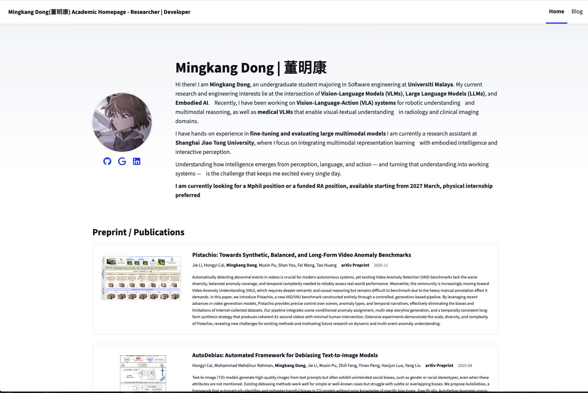

# Mingkang's Blog Template

This is a template that serves as your academic homepage + personal blog page.

It is very welcomed to use this as your astro template if interested.

## Demo



## Usage

- `/public` manages icons, paper images and fonts for public resources  
- `/src/content` is just like any other astro templates which include blog markdown files.  
- `/pages/index.astro` the main page.  
- `/data/publications.json` is the file that exclusively structure your publications, including dates (with automatic sorting by time), authors, links, abstracts and etc.  

## Quickstart

Clone the repository and install dependencies:

```bash
npm install
```

To start the development server:

```bash
npm run dev
```

Build for production:

```bash
npm run build
```

To push into wrangler for your cloudflare:

```bash
<<<<<<< HEAD
npx wrangler pages deploy dist --project-name mingkang
=======
npm run build && npx wrangler deploy
>>>>>>> 4b7480b4b5d67795ddd6a22d39e15fcabdbabb62
```

