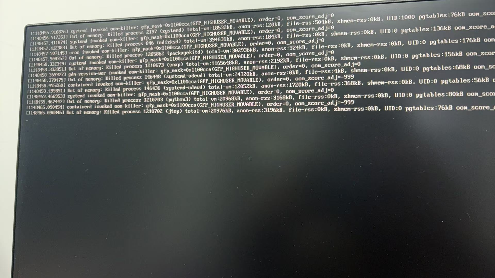

## Background

While working on deploying our SJTU lab's work **Evo-1** on Jetson Orin, I hit a wall. I was trying to compile flash attention in the docker on the Jetson Orin. Since the RAM memory on Jetson Orin is too small, only 16 GB is not enough to compile many usual frame works.Since we can't easily solder more RAM onto the board, the only solution is to expand the **Swap memory** (Virtual RAM).

---

Here is the quick snippet I use to set up a 16GB/32GB swap file.

## Quick Commands

### Step 1 : Create the swap file

I recommend giving it at least 16 GB if you are messing with LLMs

`sudo fallocate -l 16G /swapfile`

### Step 2: Secure it

`sudo chmod 600 /swapfile`

### Step 3: Enable it

`sudo mkswap /swapfile`\
`sudo swapon /swapfile`

### Step 4: Verify

`free -h`

### Step 5: Auto-mount on Boot

if you don' do this you will have to redo the `swapon`command every time you restart the jetson.

`sudo sh -c 'echo "/swapfile none swap sw 0 0" >> /etc/fstab'`

---

### Monitoring Tools

How do I know if it's actually working?

- **`jtop`**: This is the best tool for Jetson. It shows GPU load and RAM/Swap usage in real-time.
- **`htop`**: Good for finding out which specific compilation thread is hogging memory.
- **`free -h`**: For a quick snapshot.
